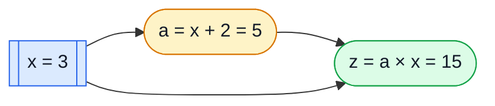
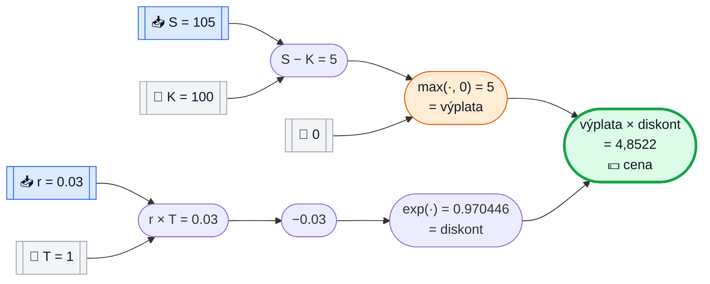
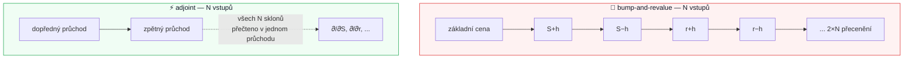

# Adjungovaná diferenciace, polopatě

Tato stránka vysvětluje ten jeden trik, na kterém stojí celý engine:
**adjungovanou automatickou diferenciaci** ("AAD" v `AadEngine`, `AadTape`,
`AadRecorder`). Zatím žádné finance, žádné Monte Carlo — jen aritmetika, kterou
si ověříte na kalkulačce. Finance přijdou na řadu ve 4. kapitole, až bude
samotný trik nudný a samozřejmý.

> 🎯 **Krátká odpověď:** abyste dostali *sklon* výpočtu vzhledem ke každému
> jeho vstupu, nemusíte celý výpočet znovu spouštět pro každý vstup zvlášť.
> Spustíte ho **jednou dopředu**, pak projdete stejné kroky **jednou pozpátku**
> a po cestě násobíte lokální sklony. Jeden navazující průchod vám dá *všechny*
> citlivosti najednou — o to jde. Všechno níže je jen rozvedení téhle jedné
> věty na konkrétním příkladu.

---

## 🧵 Kapitola 1 — Nejjednodušší možný případ

Vezměme nejmenší možný výpočet, který má ještě dva vstupy:

$$
z = x \times y
$$

kde $x = 3$, $y = 4$, tedy $z = 12$.

**Otázka:** pohne-li se $x$ o kousíček, o kolik se pohne $z$? A co když se
místo toho pohne $y$?

Odpověď z matematické analýzy už znáte — $\partial z/\partial x = y$ a
$\partial z/\partial y = x$ — ale pojmenujme si *proč*, protože to "proč" je
celá tahle technika:

```text
   z = x * y
       ┌───┴───┐
       x       y
```

`z` vzniká z jedné operace, `MUL`, se dvěma operandy. **Každá operace má
pravidlo, jak se drobná změna jednoho operandu promítne do drobné změny
výsledku:**

| platí-li `z = a * b`, pak | slovy |
|---|---|
| změna `a` posune `z` o `b`-násobek této změny | "druhý operand je ten sklon" |
| změna `b` posune `z` o `a`-násobek této změny | totéž, zrcadlově |

Dosaďme čísla: posun $x$ pohne $z$ o $y=4$-násobek
($\partial z/\partial x = 4$); posun $y$ pohne $z$ o $x=3$-násobek
($\partial z/\partial y = 3$). Víc k tomu není — tohle je adjungované
pravidlo. Zbytek stránky je jen "co se stane, když jich za sebe zřetězíte pár
set."

---

## 🔗 Kapitola 2 — Dvě operace a řetízkové (chain-rule) pravidlo

Teď necháme jednu operaci navazovat na druhou:

$$
z = (x + 2) \times x, \qquad x = 3
$$

Zapišme to jako dva kroky, přesně tak, jak to uvidí kód:

```text
a = x + 2        (ADD)
z = a * x        (MUL)      <- pozor: x se použije dvakrát
```

### Dopředný průchod — počítáme zleva doprava, každou mezihodnotu si pamatujeme

| krok | operace | hodnota |
|---|---|--:|
| `a` | $x + 2$ | $3 + 2 = 5$ |
| `z` | $a \times x$ | $5 \times 3 = 15$ |



Všimněte si šipky, která vede z `x` rovnou do `z`, mimo `a`: **`x` se
používá na dvou místech.** Zapamatujte si to — je to detail, na kterém
začátečníci nejčastěji zakopnou, a adjungovaná metoda si s ním poradí sama.

### Zpětný průchod — projdeme stejné kroky pozpátku

Tady je to jediné pravidlo, na kterém stojí celý engine:

> Nejdřív řekneme "výsledek závisí sám na sobě se sklonem 1." Pak pro každý
> krok, v **opačném** pořadí, rozešleme příchozí sklon na jeho vstupy podle
> *lokálního* pravidla dané operace (násobení, sčítání, cokoliv to je).
> **Pokud se hodnota použila víckrát, její příchozí sklony se sečtou.**

Projděme si to ručně. Pro každou veličinu sledujeme běžící číslo
"jak moc na tomhle záleží konečnému výsledku" — říkejme mu **adjoint**,
zapisovaný $\bar{\cdot}$.

| krok (v opačném pořadí) | použité pravidlo | výsledek |
|---|---|--:|
| start | $\bar z = 1$ (z závisí samo na sobě se sklonem 1) | $\bar z = 1$ |
| `z = a * x` | $\bar a \mathrel{+}= \bar z \times x$ (pravidlo MUL, druhý operand je $x=3$) | $\bar a = 1 \times 3 = 3$ |
| `z = a * x` | $\bar x \mathrel{+}= \bar z \times a$ (pravidlo MUL, druhý operand je $a=5$) | $\bar x = 1 \times 5 = 5$ |
| `a = x + 2` | $\bar x \mathrel{+}= \bar a \times 1$ (pravidlo ADD: sklon je vždy 1) | $\bar x = 5 + 3 = 8$ |

Výsledek: $\bar x = \partial z/\partial x = 8$.

**Ověřte si to obyčejnou matematickou analýzou** — je dobré si to jako
začátečník ověřovat vždycky: $z = (x+2)x = x^2 + 2x$, tedy
$z' = 2x + 2 = 2(3) + 2 = 8$. ✅ Sedí, a všimněte si *proč* to sedí: $x$
přispěl dvakrát (jednou přímo do `z`, jednou přes `a`) a oba příspěvky —
$5$ a $3$ — se opravdu musely **sečíst**, aby vyšlo $8$. Tahle sčítající se
kumulace u znovupoužitých hodnot je jediný důvod, proč je adjungovaná metoda
správná, a ne jen šikovná zkratka.

---

## 📼 Kapitola 3 — Přesně tohle ukládá `AadTape`

NablaTensor nepočítá derivace symbolicky ani je neodhaduje numericky
"poštrcháváním" vstupů. Zaznamená přesnou posloupnost operací z předchozí
kapitoly jako plochý seznam uzlů — **pásku** (tape) — a pak přesně provede
dopředný/zpětný průchod, který jste si právě spočítali ručně, jen v kódu.
Pravidla pro jednotlivé operace (`nablatensor-engine-cpu`, třída `ScalarReplay` —
stejná pravidla implementuje každý backend: CPU, SIMD, Vulkan, ROCm, CUDA)
jsou:

| operace | dopředu | zpět (adjungované pravidlo) | ikona |
|---|---|---|---|
| `ADD` (`a+b`) | `v = a + b` | $\bar a\mathrel{+}=\bar z$, $\bar b\mathrel{+}=\bar z$ | ➕ |
| `SUB` (`a-b`) | `v = a - b` | $\bar a\mathrel{+}=\bar z$, $\bar b\mathrel{-}=\bar z$ | ➖ |
| `MUL` (`a*b`) | `v = a * b` | $\bar a\mathrel{+}=\bar z \cdot b$, $\bar b\mathrel{+}=\bar z \cdot a$ | ✖️ |
| `DIV` (`a/b`) | `v = a / b` | $\bar a\mathrel{+}=\bar z / b$, $\bar b\mathrel{-}=\bar z \cdot v / b$ | ➗ |
| `NEG` (`-a`) | `v = -a` | $\bar a\mathrel{-}=\bar z$ | 🔄 |
| `EXP` | `v = exp(a)` | $\bar a\mathrel{+}=\bar z \cdot v$ | 📈 |
| `LOG` | `v = log(a)` | $\bar a\mathrel{+}=\bar z / a$ | 📉 |
| `SQRT` | `v = sqrt(a)` | $\bar a\mathrel{+}=\bar z \cdot 0.5 / v$ | √ |
| `ABS` | `v = \|a\|` | $\bar a\mathrel{+}=\bar z \cdot \text{sign}(a)$ | 🪞 |
| `MAX` (`a,b`) | `v = max(a,b)` | vítěz dostane $\bar z$, poražený nic | 🏆 |
| `MIN` (`a,b`) | `v = min(a,b)` | vítěz dostane $\bar z$, poražený nic | 🥉 |

("Vítěz" u `MAX` znamená to z `a`, `b`, co bylo při dopředném průchodu
skutečně větší — adjoint teče jen tou větví, která se při výpočtu opravdu
použila.)

Příklad `(x+2)*x` zapsaný přesně tak, jak by ho napsala aplikace — proti
`SDouble` místo proti `double`:

```java
AadTape tape = AadRecorder.record(rec -> {
  SDouble x = rec.input("x", 3.0);
  SDouble a = x.add(2.0);   // uzel: ADD
  SDouble z = a.mul(x);     // uzel: MUL
  rec.output(z);
});
```

`rec.input(...)` nic nepočítá — jen přidá uzel `ADD`/`MUL`/`INPUT` do
`AadTape` a vrátí lehký odkaz (`SDouble`) na tento uzel. `AadRecorder.record(...)`
spustí vaše lambda přesně jednou, s $x=3$, a na výstupu je přesně to pole
uzlů, které jste si výše prošli ručně. Každý další přehrání — ať už jde jen
o dopřednou hodnotu, nebo o dopředný a zpětný průchod kvůli gradientům —
prochází stejné pole; váš Java kód se znovu neparsuje ani neinterpretuje.

---

## 💰 Kapitola 4 — Skutečná opce, pět řádků, dvě "Greeks"

Čas přidat finance — diskontovanou výplatu call opce "in-the-money", zatím
bez náhodnosti, aby zůstala každá hodnota ověřitelná ručně:

$$
\text{cena} = e^{-rT} \times \max(S - K,\, 0)
$$

kde spot $S=105$, strike $K=100$, sazba $r=3\%$, splatnost $T=1$ rok.

```java
AadTape tape = AadRecorder.record(rec -> {
  SDouble S = rec.input("S", 105.0);
  SDouble K = rec.constant(100.0);
  SDouble r = rec.input("r", 0.03);
  SDouble T = rec.constant(1.0);

  SDouble payoff   = S.sub(K).max(0.0);   // max(S - K, 0)
  SDouble discount = r.mul(T).neg().exp(); // exp(-r*T)
  rec.output(payoff.mul(discount));
});
```

`S` a `r` jsou `rec.input(...)` — diferencovatelné, zajímají nás jejich
sklony. `K` a `T` jsou `rec.constant(...)` — pevná čísla zapečená do pásky,
nikdy se podle nich nederivuje. Je to přesně to rozlišení, které jednou
provždy použije `AadTape.markActive()`, aby zjistil, které uzly vůbec
potřebují místo pro adjoint.

### Dopředný průchod



| uzel | operace | vstupy | hodnota |
|---|---|---|--:|
| `n0` | `INPUT S` | — | $105$ |
| `n1` | `CONST K` | — | $100$ |
| `n2` | `INPUT r` | — | $0,03$ |
| `n3` | `CONST T` | — | $1$ |
| `n4` | `SUB(n0,n1)` | $S-K$ | $5$ |
| `n5` | `CONST 0` | — | $0$ |
| `n6` | `MAX(n4,n5)` | výplata | $5$ |
| `n7` | `MUL(n2,n3)` | $r \times T$ | $0,03$ |
| `n8` | `NEG(n7)` | $-rT$ | $-0,03$ |
| `n9` | `EXP(n8)` | diskont | $0,970446$ |
| `n10` | `MUL(n6,n9)` | **cena (výstup)** | $4,852228$ |

### Zpětný průchod — nastavíme `n10` na 1, projdeme tabulku odspodu nahoru

| uzel (v opačném pořadí) | pravidlo z tabulky ve 3. kapitole | adjoint |
|---|---|--:|
| `n10` start | $\bar{n10}=1$ | $1$ |
| `n10 = MUL(n6,n9)` | $\bar{n6}\mathrel{+}=\bar{n10}\cdot v_{9}=1\times0,970446$ | $\bar{n6}=0,970446$ |
| `n10 = MUL(n6,n9)` | $\bar{n9}\mathrel{+}=\bar{n10}\cdot v_{6}=1\times5$ | $\bar{n9}=5$ |
| `n9 = EXP(n8)` | $\bar{n8}\mathrel{+}=\bar{n9}\cdot v_{9}=5\times0,970446$ | $\bar{n8}=4,852228$ |
| `n8 = NEG(n7)` | $\bar{n7}\mathrel{-}=\bar{n8}$ | $\bar{n7}=-4,852228$ |
| `n7 = MUL(n2,n3)` | $\bar{n2}\mathrel{+}=\bar{n7}\cdot v_{3}=-4,852228\times1$ | $\bar{n2}=-4,852228$ |
| `n6 = MAX(n4,n5)` | $v_4(5) \ge v_5(0)$, vítězí `n4`: $\bar{n4}\mathrel{+}=\bar{n6}$ | $\bar{n4}=0,970446$ |
| `n4 = SUB(n0,n1)` | $\bar{n0}\mathrel{+}=\bar{n4}$ | $\bar{n0}=0,970446$ |

Adjointy obou uzlů `INPUT` si přečteme rovnou z tabulky — **a to je vše,
obě "Greeks" z jediného zpětného průchodu**:

| Greek | uzel na pásce | hodnota | kontrola |
|---|---|--:|---|
| **Delta** $\partial \text{cena}/\partial S$ | $\bar{n0}$ | $0,970446$ | rovná se diskontnímu faktoru — přesně tak to má být, protože jeden dolar navíc na spotu je jeden dolar navíc výplaty "in-the-money", diskontovaný |
| **Rho** $\partial \text{cena}/\partial r$ | $\bar{n2}$ | $-4,852228$ | rovná se $-T\times\text{cena}$ — přesně tak to má být, protože cena $= e^{-rT}\times\text{konstanta}$ |

Obě hodnoty souhlasí s obyčejnou matematickou analýzou, a k jejich získání
nebylo potřeba pásku projít podruhé ani cokoliv poštrchat a přepočítat.

---

## ⚡ Kapitola 5 — Proč je to lepší než "prostě poštrchat každý vstup"

Nasnadě je jiný přístup, **bump-and-revalue**: posunout $S$ o kousek nahoru,
přecenit; posunout $S$ o kousek dolů, přecenit; odečíst, vydělit velikostí
posunu; totéž zopakovat pro $r$; totéž pro každý další vstup, který nás
zajímá. Pro náš dvouvstupý ukázkový příklad to jsou 4 přecenění navíc. Skutečné
oceňování má pět, deset, klidně desítky "Greeks".



Bump-and-revalue stojí **1 + 2N** kompletních ocenění pro N "Greeks". Adjoint
stojí **zhruba 2** ocenění — jedno dopředu, jedno zpět, *bez ohledu na to, jak
velké N je* — protože zpětný průchod spočítá adjoint všech vstupů v jednom
jediném běhu, přesně tak, jako oba adjointy `n2` i `n0` vzešly z jednoho
průchodu výše. Přesně proto vlastní benchmark projektu (viz
[`README.md`](../README.md#the-benchmark)) ukazuje, že **jeden adjungovaný
průchod** odpovídá **jedenácti** centrálním bump přeceněním pro 5 "Greeks",
za cenu srovnatelnou se samotným oceněním:

| metoda | kompletních ocenění | čas běhu (benchmark projektu, 2M scénářů) |
|---|--:|--:|
| adjoint — cena + 5 Greeks | 1 | 1,11 s |
| centrální bump — 1 + 2×5 | 11 | 10,76 s |

Rozdíl se s přibývajícími "Greeks" jen prohlubuje: bump-and-revalue roste
lineárně s počtem vstupů, adjoint neroste vůbec.

---

## 🎲 Kapitola 6 — Jak se tohle škáluje na miliony scénářů Monte Carlo

Ve všem výše bylo pevné $S=105$. Skutečné ocenění metodou Monte Carlo přidává
tahy `rec.randn()`, aby simulovalo tisíce možných budoucích cest — ale
**samotná páska se nemění**. `AadRecorder.record(...)` spustí vaše payoff
lambda přesně **jednou**, při zaznamenávání, aby zachytilo tvar výpočtu
(jaké operace, v jakém pořadí, s jakými znovupoužitými hodnotami) — ne aby
spočítalo miliony čísel, které skutečný risk běh potřebuje. Náhodné tahy se
na pásce jen rezervují jako místa, negenerují se při zaznamenávání:

```java
SDouble s = s0.mul(rec.randn().mul(vol).add(drift).exp());
```

Poté vezme replay engine pro konkrétní zařízení (`cpu-jit`, `simd`,
`vulkan`, ...) tuhle jednu pevnou pásku a provede dopředný+zpětný průchod,
který jste si výše spočítali ručně, jednou pro každou cestu Monte Carlo, a
pokaždé vygeneruje čerstvé náhodné tahy — miliony dopředných a zpětných
průchodů nad *stejnou* zaznamenanou aritmetikou. Z toho, co už znáte, plynou
dva důsledky:

- **Uzly `RANDN`/`RANDU`/`CONST` nikdy nedostanou adjoint.** `K` a `T` ze
  4. kapitoly byly konstanty a taky nedostaly žádný užitečný adjoint — stejná
  účetní logika `markActive()`, která je přeskočila, přeskočí i každý
  náhodný tah, takže zpětný průchod nikdy neztrácí čas derivováním "podle
  hodu kostkou," jen podle skutečných vstupů jako `S` a `r`.
- **Znovupoužité hodnoty se pořád jen sčítají**, přesně jako $x$
  ve 2. kapitole — spotová cesta, která vstupuje jak do difuze tohoto kroku,
  tak dalšího, nebo volatilita použitá ve 252 denních krocích, automaticky
  akumuluje svůj adjoint ze všech míst, kde se použila.

---

## 📋 Tahák

```text
┌─────────────────────────────────────────────────────────────┐
│  1. ZÁZNAM     napište výplatu jednou, v SDouble              │
│                → AadRecorder zachytí plochý seznam uzlů       │
│                                                                │
│  2. DOPŘEDU    projděte uzly zleva doprava, počítejte          │
│                a pamatujte si hodnoty                          │
│                → dostanete cenu                                │
│                                                                │
│  3. START      nastavte adjoint výstupního uzlu na 1          │
│                                                                │
│  4. ZPĚT       projděte uzly zprava doleva, rozešlete adjointy │
│                podle tabulky pravidel pro operace (Kapitola 3) │
│                → znovupoužité hodnoty se SČÍTAJÍ, nepřepisují   │
│                                                                │
│  5. PŘEČTĚTE   adjoint na každém uzlu INPUT                    │
│                → to je "Greek" pro daný vstup, všechny naráz    │
└─────────────────────────────────────────────────────────────┘
```

---

## ❓ Časté otázky

**Proč "adjoint"?** Zpětný průchod počítá pro každou mezihodnotu "jak moc na
téhle hodnotě záleží *konečnému* výsledku?" — zrcadlový obraz dopředné
otázky "co je tohle, když známe vstupy?" Tenhle zrcadlový, transponovaný
vztah matematici nazývají *adjungovaný* (adjoint).

**Je to totéž co numerické derivace (finite differences)?** Ne — numerická
derivace (bump-and-revalue) odhaduje sklon vydělením malého rozdílu malým
číslem, což stojí jedno ocenění navíc na každý vstup a nese zaokrouhlovací
chybu z velikosti posunu. Adjungovaná diferenciace počítá *přesný* sklon
(až na běžné zaokrouhlování v plovoucí řádové čárce) pomocí pravidel pro
jednotlivé operace, v jednom jediném navazujícím průchodu. Delta a rho ze
4. kapitoly vyšly přesně, ne přibližně.

**Co když má `MAX(a, b)` `a == b` úplně přesně?** Dopředný průchod si
i tak jednu hodnotu vybere; zpětný průchod zvolí tu větev, na kterou vyjde
porovnání `>=`/`<=` (viz tabulka ve 3. kapitole). Týká se to jen přesného
zlomu ve výplatě (např. spot přesně na strike ceně) a je to dobře známá,
neškodná vlastnost každého systému AAD — nikdy to neovlivní hodnotu, jen to,
který ze dvou stejných sklonů se v tomhle jediném hraničním bodě nahlásí.

**Musí se páska znovu zaznamenávat pro každý nový tržní scénář?** Ne — o tom
je celá 6. kapitola. Zaznamenejte jednou a přehrávejte stejnou pevnou pásku
s jinými hodnotami vstupů (`setInput`) nebo jinými náhodnými tahy, kolikrát
chcete.

---

## 📚 Kam dál

- [`docs/compare/vs-bump-and-revalue.md`](compare/vs-bump-and-revalue.md) —
  stejná úvaha o ceně jako v 5. kapitole, na skutečných produktech.
- [`docs/examples/vanilla-european.md`](examples/vanilla-european.md) —
  nejmenší kompletní řešený příklad se skutečným kódem `SDouble`.
- [`docs/examples/frtb-curvature-for-beginners.md`](examples/frtb-curvature-for-beginners.md)
  — průvodce "pro začátečníky" o úroveň výš, kde je adjungovaná delta jednou
  ze součástí většího regulatorního výpočtu.
- [`docs/cookbook/custom-ops.md`](cookbook/custom-ops.md) — jak přidat
  vlastní operaci do tabulky ze 3. kapitoly.
- [`README.md`](../README.md#the-benchmark) — celkový benchmark, ze kterého
  vycházejí čísla v 5. kapitole.
