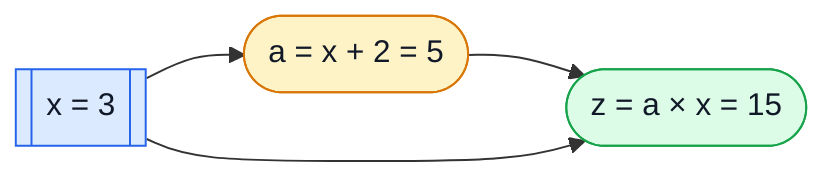
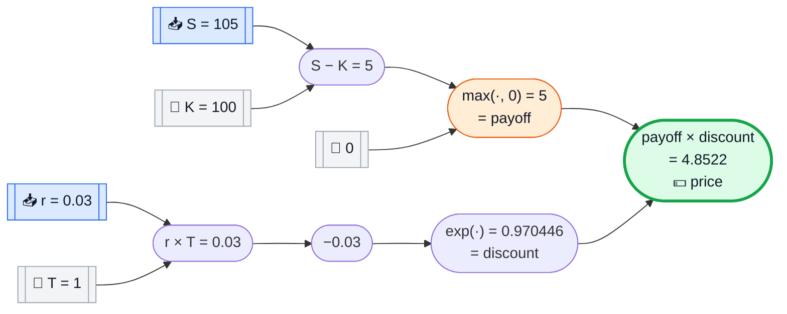
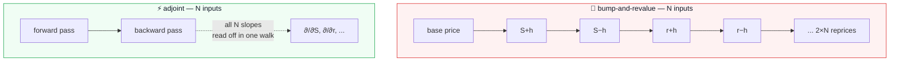

# Adjoint Differentiation, For Dummies

This page explains the one trick the whole engine is built on: **adjoint
automatic differentiation** (the "AAD" in `AadEngine`, `AadTape`,
`AadRecorder`). No finance yet, no Monte Carlo yet — just arithmetic you can
check with a pocket calculator. Finance shows up in Chapter 4, once the trick
itself is boring and obvious.

> 🎯 **The short answer:** to get the *slope* of a calculation with respect to
> every one of its inputs, you don't need to re-run the calculation once per
> input. You run it **once forward**, then walk the same steps **once
> backward**, multiplying local slopes as you go. One extra pass gives you
> *every* sensitivity at once — that's the whole idea. Everything below is
> just making that sentence concrete.

---

## 🧵 Chapter 1 — The simplest possible case

Take the smallest calculation that still has two inputs:

$$
z = x \times y
$$

with $x = 3$, $y = 4$, so $z = 12$.

**Question:** if $x$ wiggles a tiny bit, how much does $z$ wiggle? And if $y$
wiggles instead?

You already know the calculus answer — $\partial z/\partial x = y$ and
$\partial z/\partial y = x$ — but let's name *why*, because that "why" is the
entire technique:

```text
   z = x * y
       ┌───┴───┐
       x       y
```

`z` is built from one operation, `MUL`, with two operands. **Each operation
has a rule for how a nudge in one operand becomes a nudge in the result:**

| if `z = a * b`, then | in words |
|---|---|
| a nudge in `a` moves `z` by `b` times as much | "the other operand is the slope" |
| a nudge in `b` moves `z` by `a` times as much | same, mirrored |

Plug in numbers: nudging $x$ moves $z$ by $y=4$ times as much
($\partial z/\partial x = 4$); nudging $y$ moves $z$ by $x=3$ times as much
($\partial z/\partial y = 3$). That's it — that's an adjoint rule. The rest of
this page is "what happens when you chain a few hundred of these together."

---

## 🔗 Chapter 2 — Two operations, and the chain rule

Now make one operation feed another:

$$
z = (x + 2) \times x, \qquad x = 3
$$

Write it as two steps, because that's exactly how the code will see it:

```text
a = x + 2        (ADD)
z = a * x        (MUL)      <- notice: x is used twice
```

### Forward pass — compute left to right, remember every intermediate value

| step | operation | value |
|---|---|--:|
| `a` | $x + 2$ | $3 + 2 = 5$ |
| `z` | $a \times x$ | $5 \times 3 = 15$ |



Notice the arrow from `x` straight into `z`, skipping `a`: **`x` is used in
two places.** Keep that in mind — it's the detail beginners trip on, and the
adjoint method handles it for free.

### Backward pass — walk the *same* steps in reverse

Here is the one rule that runs the whole engine:

> Start by saying "the answer depends on itself with slope 1." Then, for each
> step, in **reverse** order, spread that incoming slope to its inputs using
> the *local* rule for that one operation (multiply, add, whatever it is).
> **If a value was used more than once, its incoming slopes add up.**

Walk it by hand. We track a running "sensitivity-of-the-final-answer-to-this"
number for every quantity — call it its **adjoint**, written $\bar{\cdot}$.

| step (reverse order) | rule applied | result |
|---|---|--:|
| seed | $\bar z = 1$ (z depends on itself, slope 1) | $\bar z = 1$ |
| `z = a * x` | $\bar a \mathrel{+}= \bar z \times x$ (MUL rule, other operand is $x=3$) | $\bar a = 1 \times 3 = 3$ |
| `z = a * x` | $\bar x \mathrel{+}= \bar z \times a$ (MUL rule, other operand is $a=5$) | $\bar x = 1 \times 5 = 5$ |
| `a = x + 2` | $\bar x \mathrel{+}= \bar a \times 1$ (ADD rule: slope is always 1) | $\bar x = 5 + 3 = 8$ |

Final answer: $\bar x = \partial z/\partial x = 8$.

**Check it with ordinary calculus**, as a beginner reflex you should always
keep: $z = (x+2)x = x^2 + 2x$, so $z' = 2x + 2 = 2(3) + 2 = 8$. ✅ Matches,
and notice *why* it matches: $x$ contributed twice (once directly into `z`,
once through `a`), and the two contributions — $5$ and $3$ — really did need
to **add up** to $8$. That additive accumulation at reused values is the
entire reason the adjoint method is correct, not just a shortcut.

---

## 📼 Chapter 3 — This is literally what `AadTape` stores

NablaTensor doesn't do calculus symbolically and it doesn't guess numerically
by bumping inputs. It records the exact sequence of operations above as a flat
array of nodes — the **tape** — and then runs precisely the forward/backward
walk you just did by hand, in code. The rules per operation
(`nablatensor-cpu`'s `ScalarReplay`, the same rules every backend — CPU,
SIMD, Vulkan, ROCm, CUDA — implements) are:

| op | forward | backward (adjoint rule) | icon |
|---|---|---|---|
| `ADD` (`a+b`) | `v = a + b` | $\bar a\mathrel{+}=\bar z$, $\bar b\mathrel{+}=\bar z$ | ➕ |
| `SUB` (`a-b`) | `v = a - b` | $\bar a\mathrel{+}=\bar z$, $\bar b\mathrel{-}=\bar z$ | ➖ |
| `MUL` (`a*b`) | `v = a * b` | $\bar a\mathrel{+}=\bar z \cdot b$, $\bar b\mathrel{+}=\bar z \cdot a$ | ✖️ |
| `DIV` (`a/b`) | `v = a / b` | $\bar a\mathrel{+}=\bar z / b$, $\bar b\mathrel{-}=\bar z \cdot v / b$ | ➗ |
| `NEG` (`-a`) | `v = -a` | $\bar a\mathrel{-}=\bar z$ | 🔄 |
| `EXP` | `v = exp(a)` | $\bar a\mathrel{+}=\bar z \cdot v$ | 📈 |
| `LOG` | `v = log(a)` | $\bar a\mathrel{+}=\bar z / a$ | 📉 |
| `SQRT` | `v = sqrt(a)` | $\bar a\mathrel{+}=\bar z \cdot 0.5 / v$ | √ |
| `ABS` | `v = \|a\|` | $\bar a\mathrel{+}=\bar z \cdot \text{sign}(a)$ | 🪞 |
| `MAX` (`a,b`) | `v = max(a,b)` | winner gets $\bar z$, loser gets nothing | 🏆 |
| `MIN` (`a,b`) | `v = min(a,b)` | winner gets $\bar z$, loser gets nothing | 🥉 |

("winner" for `MAX` means whichever of `a`, `b` was actually larger during
the forward pass — the adjoint only flows through the branch that was taken.)

The `(x+2)*x` example, written exactly the way application code writes it,
against `SDouble` instead of `double`:

```java
AadTape tape = AadRecorder.record(rec -> {
  SDouble x = rec.input("x", 3.0);
  SDouble a = x.add(2.0);   // node: ADD
  SDouble z = a.mul(x);     // node: MUL
  rec.output(z);
});
```

`rec.input(...)` doesn't compute anything — it appends an `ADD`/`MUL`/`INPUT`
*node* to `AadTape` and hands back a lightweight handle (`SDouble`) to that
node. `AadRecorder.record(...)` runs your lambda exactly once, with $x=3$, and
what comes out the other end is the array of nodes you traced by hand above.
Every replay after that — forward value, or forward-then-backward for
gradients — walks that same array; nothing is re-parsed or re-interpreted
from your Java code again.

---

## 💰 Chapter 4 — A real option, five lines, two Greeks

Time to add finance — a discounted, in-the-money call payoff, no randomness
yet so every number stays checkable by hand:

$$
\text{price} = e^{-rT} \times \max(S - K,\, 0)
$$

with spot $S=105$, strike $K=100$, rate $r=3\%$, maturity $T=1$ year.

```java
AadTape tape = AadRecorder.record(rec -> {
  SDouble S = rec.input("S", 105.0);
  SDouble K = rec.constant(100.0);
  SDouble r = rec.input("r", 0.03);
  SDouble T = rec.constant(1.0);

  SDouble payoff   = S.sub(K).max(0.0);   // max(S - K, 0)
  SDouble discount = r.mul(T).neg().exp(); // exp(-r*T)
  rec.output(payoff.mul(discount));
});
```

`S` and `r` are `rec.input(...)` — differentiable, we want their slopes.
`K` and `T` are `rec.constant(...)` — fixed numbers baked into the tape,
never differentiated. This is the same distinction `AadTape.markActive()`
uses to decide, once, which nodes even need an adjoint slot.

### Forward pass



| node | op | inputs | value |
|---|---|---|--:|
| `n0` | `INPUT S` | — | $105$ |
| `n1` | `CONST K` | — | $100$ |
| `n2` | `INPUT r` | — | $0.03$ |
| `n3` | `CONST T` | — | $1$ |
| `n4` | `SUB(n0,n1)` | $S-K$ | $5$ |
| `n5` | `CONST 0` | — | $0$ |
| `n6` | `MAX(n4,n5)` | payoff | $5$ |
| `n7` | `MUL(n2,n3)` | $r \times T$ | $0.03$ |
| `n8` | `NEG(n7)` | $-rT$ | $-0.03$ |
| `n9` | `EXP(n8)` | discount | $0.970446$ |
| `n10` | `MUL(n6,n9)` | **price (output)** | $4.852228$ |

### Backward pass — seed `n10` with 1, walk the table upward

| node (reverse order) | rule from Chapter 3's table | adjoint |
|---|---|--:|
| `n10` seed | $\bar{n10}=1$ | $1$ |
| `n10 = MUL(n6,n9)` | $\bar{n6}\mathrel{+}=\bar{n10}\cdot v_{9}=1\times0.970446$ | $\bar{n6}=0.970446$ |
| `n10 = MUL(n6,n9)` | $\bar{n9}\mathrel{+}=\bar{n10}\cdot v_{6}=1\times5$ | $\bar{n9}=5$ |
| `n9 = EXP(n8)` | $\bar{n8}\mathrel{+}=\bar{n9}\cdot v_{9}=5\times0.970446$ | $\bar{n8}=4.852228$ |
| `n8 = NEG(n7)` | $\bar{n7}\mathrel{-}=\bar{n8}$ | $\bar{n7}=-4.852228$ |
| `n7 = MUL(n2,n3)` | $\bar{n2}\mathrel{+}=\bar{n7}\cdot v_{3}=-4.852228\times1$ | $\bar{n2}=-4.852228$ |
| `n6 = MAX(n4,n5)` | $v_4(5) \ge v_5(0)$, so `n4` wins: $\bar{n4}\mathrel{+}=\bar{n6}$ | $\bar{n4}=0.970446$ |
| `n4 = SUB(n0,n1)` | $\bar{n0}\mathrel{+}=\bar{n4}$ | $\bar{n0}=0.970446$ |

Read the two `INPUT` adjoints off the table — **that's it, both Greeks, from
one backward walk**:

| Greek | tape node | value | sanity check |
|---|---|--:|---|
| **Delta** $\partial \text{price}/\partial S$ | $\bar{n0}$ | $0.970446$ | equals the discount factor — exactly right, since one extra dollar of spot is one extra dollar of in-the-money payoff, discounted |
| **Rho** $\partial \text{price}/\partial r$ | $\bar{n2}$ | $-4.852228$ | equals $-T\times\text{price}$ — exactly right, since price $= e^{-rT}\times\text{const}$ |

Both check out against plain calculus, and neither required touching the
tape a second time or perturbing $S$ or $r$ and re-running anything.

---

## ⚡ Chapter 5 — Why this beats "just nudge each input"

The obvious alternative is **bump-and-revalue**: nudge $S$ up a hair, reprice;
nudge $S$ down a hair, reprice; subtract, divide by the bump size; repeat for
$r$; repeat for every other input you care about. For our 2-input toy example
that's 4 extra reprices. Real valuations have five, ten, dozens of Greeks.



Bump-and-revalue costs **1 + 2N** full valuations for N Greeks. Adjoint costs
**about 2** valuations — one forward, one backward, *no matter how large N
is* — because the backward walk computes every input's adjoint in the same
single pass, the way `n2`'s and `n0`'s adjoints both came out of one walk
above. That's the whole reason the project's own benchmark
(see [`README.md`](../README.md#the-benchmark)) shows **one adjoint sweep**
matching **eleven** central-bump revaluations for 5 Greeks, at roughly the
cost of pricing alone:

| method | full valuations | wall clock (project benchmark, 2M scenarios) |
|---|--:|--:|
| adjoint — value + 5 Greeks | 1 | 1.11 s |
| central bump — 1 + 2×5 | 11 | 10.76 s |

The gap only widens as more Greeks are added: bump-and-revalue grows
linearly with the number of inputs, adjoint doesn't grow at all.

---

## 🎲 Chapter 6 — Scaling this up to millions of Monte Carlo paths

Everything above used one fixed $S=105$. A real Monte Carlo valuation adds
`rec.randn()` draws to simulate thousands of possible future paths — but
**the tape itself doesn't change**. `AadRecorder.record(...)` runs your
payoff lambda exactly **once**, during recording, to capture the shape of the
calculation (which ops, in which order, with which reused values) — not to
compute the millions of numbers a real risk run needs. Random draws are
reserved as slots in the tape, not generated during recording:

```java
SDouble s = s0.mul(rec.randn().mul(vol).add(drift).exp());
```

Afterwards, a device-specific replay engine (`cpu-jit`, `simd`, `vulkan`, ...)
takes that one fixed tape and runs the forward+backward walk you did by hand
above, once per Monte Carlo path, generating fresh random draws each time —
millions of forward/backward walks over the *same* recorded arithmetic. Two
details fall out of what you already learned:

- **`RANDN`/`RANDU`/`CONST` nodes never receive an adjoint.** Chapter 4's `K`
  and `T` were constants and got no useful adjoint either — the same
  `markActive()` bookkeeping that skipped them skips every random draw too,
  so the backward walk never wastes time differentiating "with respect to a
  dice roll," only with respect to genuine inputs like `S` and `r`.
- **Reused values still just add up**, exactly like `x` in Chapter 2 — a
  spot path that feeds both this step's diffusion *and* next step's, or a
  volatility used in 252 daily steps, accumulates its adjoint contributions
  from every place it was used, automatically.

---

## 📋 Cheat sheet

```text
┌─────────────────────────────────────────────────────────────┐
│  1. RECORD   write the payoff once, in SDouble               │
│              → AadRecorder captures a flat array of nodes    │
│                                                                │
│  2. FORWARD  walk nodes left→right, compute + remember values │
│              → gives you the price                            │
│                                                                │
│  3. SEED     set the adjoint of the output node to 1          │
│                                                                │
│  4. BACKWARD walk nodes right→left, spread adjoints to inputs │
│              using the per-op rule table (Chapter 3)          │
│              → reused values ACCUMULATE, never overwrite       │
│                                                                │
│  5. READ OFF the adjoint sitting on every INPUT node          │
│              → that's the Greek for that input, all at once   │
└─────────────────────────────────────────────────────────────┘
```

---

## ❓ FAQ

**Why "adjoint"?** The backward walk computes, for every intermediate value,
"how much does the *final* answer care about *this*?" — the mirror image of
the forward walk's "given the inputs, what is this?" Mathematicians call that
mirrored, transposed relationship the *adjoint*.

**Is this the same as finite differences?** No — finite differences (bump-
and-revalue) approximates a slope by dividing a difference by a small number,
which costs one extra full valuation per input and carries rounding error
from the bump size. Adjoint differentiation computes the *exact* slope (up to
ordinary floating-point rounding) using the calculus rules per operation, in
one extra pass total. Chapter 4's Delta and Rho came out exact, not
approximate.

**What if `MAX(a, b)` has `a == b` exactly?** The forward pass still picks a
value; the backward pass picks whichever branch the `>=`/`<=` comparison
resolves to (see the table in Chapter 3). This matters only at a payoff's
exact kink (e.g. spot precisely at the strike) and is a well-known, benign
property of any AAD system — it never affects the value, only which of two
equal slopes gets reported at a single knife-edge point.

**Does the tape have to be re-recorded for every new market scenario?**
No — that's the point of Chapter 6. Record once, replay the fixed tape with
different input values (`setInput`) or different random draws, however many
times you like.

---

## 📚 Where to go next

- [`docs/compare/vs-bump-and-revalue.md`](compare/vs-bump-and-revalue.md) —
  the same cost argument as Chapter 5, per real product.
- [`docs/examples/vanilla-european.md`](examples/vanilla-european.md) — the
  smallest complete worked example with real `SDouble` code.
- [`docs/examples/frtb-curvature-for-beginners.md`](examples/frtb-curvature-for-beginners.md)
  — a "for beginners" walkthrough one level up, using adjoint delta as one
  ingredient of a bigger regulatory calculation.
- [`docs/cookbook/custom-ops.md`](cookbook/custom-ops.md) — adding your own
  operation to the table in Chapter 3.
- [`README.md`](../README.md#the-benchmark) — the full-scale benchmark this
  page's Chapter 5 numbers are drawn from.
