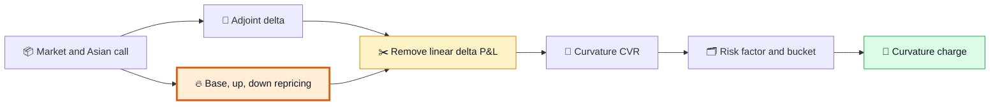
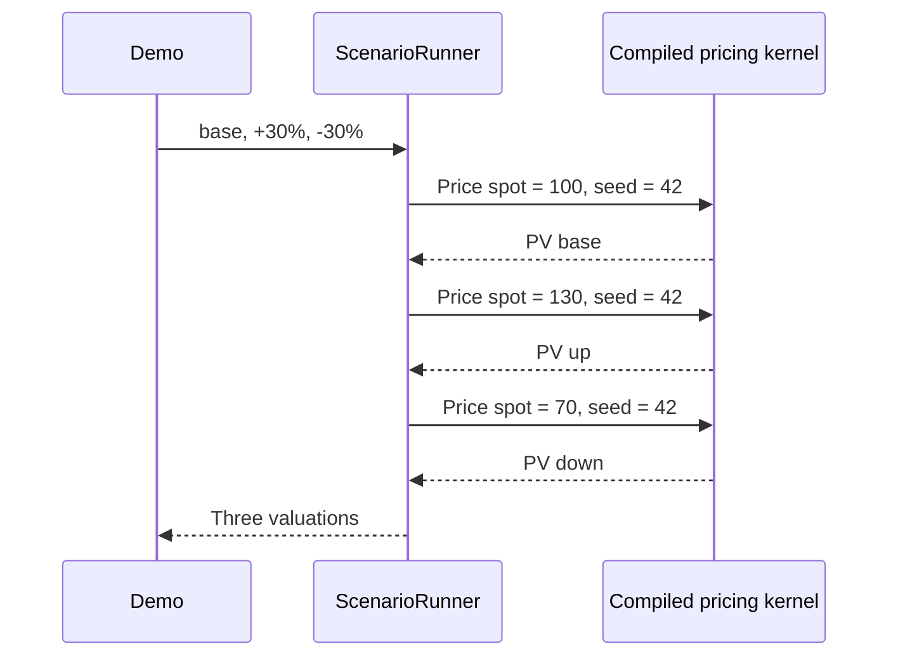
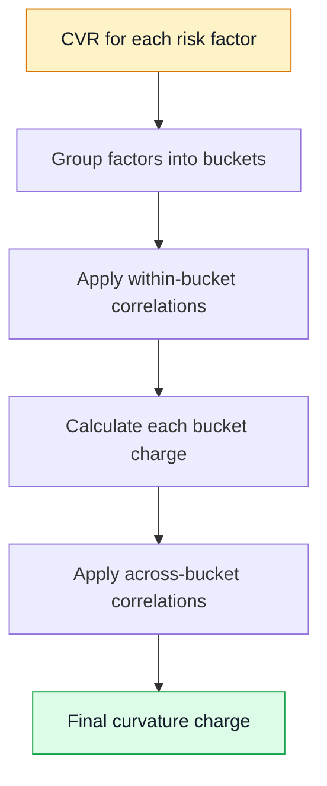

# FRTB Curvature, Explained Simply

This page explains what
[`FrtbCurvatureShowcase`](../../nablatensor-examples/src/main/java/com/nablatensor/examples/FrtbCurvatureShowcase.java)
calculates, where each calculation happens, and why it is needed.

> 🎯 **The short answer:** the demo asks, "How badly can this option lose money
> when its share price is moved sharply up or down?" The slow part is pricing
> the option again in both shocked markets. The arithmetic afterwards is small.

## The whole story

The example contains one **short Asian call option**. "Short" means the bank
sold the option and owes its payoff. "Asian" means the payoff depends on the
average share price over 252 daily observations, so Monte Carlo simulation is
used to price it.

```text
                     ONE SHORT ASIAN CALL
                              |
                 +------------+------------+
                 |            |            |
              BASE PV      SPOT +30%     SPOT -30%
                 |            |            |
                 |       full reprice  full reprice
                 |            |            |
                 +------------+------------+
                              |
                    remove ordinary delta P&L
                              |
                         curvature CVR
                              |
                   FRTB bucket aggregation
                              |
                       curvature charge
```

The program uses a $30\%$ equity shock. With the default market, spot is
$S_0=100$, so the absolute shock is:

$$
s = 0.30 \times 100 = 30.
$$

The shocked spot values are therefore 130 and 70.

## Five stages



### 1. Create the market and shocks 📦

The setup is near the beginning of the
[showcase source](../../nablatensor-examples/src/main/java/com/nablatensor/examples/FrtbCurvatureShowcase.java#L43).

```java
EquityMarket market = EquityMarket.atmOneYear();

ScenarioSet shocks = ScenarioSet.list(
    Scenario.of("base"),
    Scenario.of("spot-up", Shock.relative("spot", 0.30)),
    Scenario.of("spot-down", Shock.relative("spot", -0.30)));
```

`EquityMarket.atmOneYear()` supplies a simple market:

| Input | Value | Meaning |
|---|---:|---|
| Spot | 100 | Share price today. |
| Strike | 100 | Price at which the call starts paying. |
| Volatility | 20% | How strongly the share price moves. |
| Rate | 3% | Risk-free interest rate. |
| Maturity | 1 year | Time until the option expires. |

The three scenarios are only data. They say "do not move spot," "multiply spot
by 1.30," and "multiply spot by 0.70."

### 2. Calculate delta once 🧭

The first Monte Carlo kernel has `.greeks()` enabled:

```java
MonteCarlo.of(Products.asianCall())
    .market(market).steps(252).fp64().greeks().on(engine).build();
```

It returns **delta**, the option's first-order response to a small spot move:

$$
\Delta \approx \frac{\text{change in PV}}{\text{small change in spot}}.
$$

NablaTensor obtains delta with one adjoint reverse sweep. The position is short,
so the demo multiplies the option's value and delta by $-1$.

### 3. Reprice the large shocks 🔥

This is the important and expensive stage. A second, price-only kernel runs for
the base, up, and down markets:

```java
ScenarioRunner.run(pricer, market, shocks, scenarios, seed);
```



The kernel is compiled once and replayed. It is not rebuilt for each shock.
Nevertheless, every replay must simulate every path and all 252 fixings. In a
bank book, two shocked repricings may be needed for thousands of risk factors:

$$
N_{\text{shocked valuations}} = 2N_{\text{curvature factors}}.
$$

For 10,000 factors, that is 20,000 full shocked valuations. This is why the
orange section in the shell demo marks repricing as the bottleneck.

### 4. Remove the ordinary delta effect ✂️

FRTB curvature should capture the **bending** of the price, not the straight-line
movement already represented by delta. The helper
[`curvatureValue`](../../nablatensor-examples/src/main/java/com/nablatensor/examples/FrtbCurvatureShowcase.java#L126)
calculates:

$$
\begin{aligned}
R_+ &= PV_+ - PV_0 - s\Delta, \\
R_- &= PV_- - PV_0 + s\Delta.
\end{aligned}
$$

Think of $s\Delta$ as a ruler laid along the price curve:

```text
       actual option value
              __/
           __/       <- bend left after the straight part is removed
        __/
     --- - - - -     <- straight delta approximation
```

The demo then selects the worse residual:

$$
CVR = -\min(R_+,R_-).
$$

For example, one run produced approximately:

```text
base PV     =  -5.476
up PV       = -31.044
down PV     =  -0.010
delta       =  -0.562
shock       =  30

up residual   = -31.044 - (-5.476) - 30(-0.562) = -8.71
down residual =  -0.010 - (-5.476) + 30(-0.562) = -11.39

CVR = -min(-8.71, -11.39) = 11.39
```

The down shock is worse in this run, so it determines CVR.

### 5. Put CVR into an FRTB bucket 🗂️

The demo labels the value as an equity curvature risk factor:

```java
RiskFactor factor =
    RiskFactor.equityDelta("5", "ASIAN-CALL").asCurvature();
```

- `"5"` is the example equity bucket.
- `"ASIAN-CALL"` names the factor.
- `asCurvature()` says the number is CVR, not delta.

`Sensitivities.builder()` stores that factor and its CVR. Then
`NestedAggregation.curvature(...)` applies the curvature aggregation rules.

There is only one factor in this example. Nothing exists to diversify against,
so the positive CVR and the curvature charge are the same number. A real book
has many factors and buckets; correlations then matter.



## Why use the same random seed? 🎲

Monte Carlo prices contain random sampling noise. If base, up, and down used
different random paths, part of their difference would be accidental noise.
The demo uses seed 42 for all three, which creates **common random numbers**:

```text
base path #17: uses random draws A, B, C, ...
up   path #17: uses random draws A, B, C, ...
down path #17: uses random draws A, B, C, ...
```

Only the market input changes. The resulting PV differences are much more
stable.

## Where the time goes ⏱️

```text
small work                                              BIG WORK
    |                                                       |
    v                                                       v
delta -----> [ BASE REPRICE ] [ +30% REPRICE ] [ -30% REPRICE ] ---> CVR ---> aggregate
                 Monte Carlo      Monte Carlo       Monte Carlo       tiny       small
```

The measured one-million-path comparison on this machine was:

| Backend | Three price replays | Relative to scalar CPU |
|---|---:|---:|
| Scalar CPU | 20.9039 s | 1.00x |
| JIT CPU | 13.0496 s | 1.60x |
| SIMD CPU | 6.2855 s | 3.33x |
| CUDA | 0.0224 s | 933.21x |

CPU measurements used fp64 and CUDA used its supported fp32 mode. These are
measurements for this highly parallel Asian-option workload, not a promise for
every bank portfolio.

## What the demo does not calculate ⚠️

This is a focused **showcase of FRTB equity curvature input generation and
aggregation**. It is not a complete FRTB implementation. It does not include:

- all seven FRTB risk classes;
- regulatory parameter tables for every bucket;
- delta and vega capital aggregation;
- default risk charge or residual risk add-on;
- trade netting, market-data loading, reporting, or regulatory sign-off.

That narrow scope is intentional: it keeps the code readable while exercising
the part most likely to dominate runtime.

## Run it ▶️

Run the plain Java example:

```bash
mvn -q -pl nablatensor-examples -am install -DskipTests
mvn -q -pl nablatensor-examples exec:java \
  -Dexec.mainClass=com.nablatensor.examples.FrtbCurvatureShowcase
```

Run the colorful CUDA walkthrough:

```bash
./demo/frtb-curvature-on-cuda.sh
```

For detailed formulas, configuration, and backend measurements, see the
[technical curvature showcase](frtb-curvature-showcase.md).